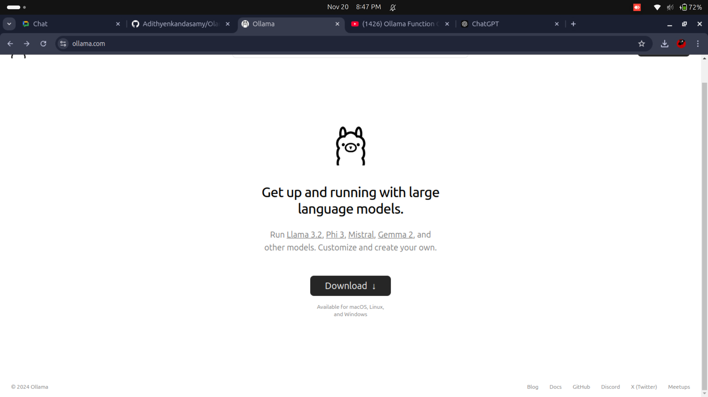

# Olama-api
using the olama localy

- go to the page and install the file and use the command to install
- llama serve
- llama pull for installing the version
- llama run for using the verison if some error come put in the chatgpt i will show that but it will requires some memory space
- if any error go to the [problems.md](problems.md)